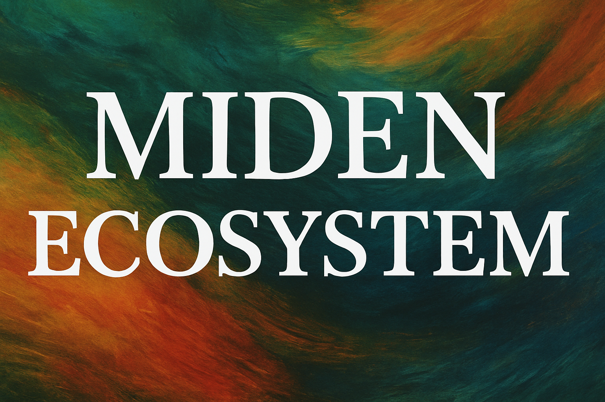

A community-maintained list of projects building on [Miden](https://miden.xyz/ecosystem) — the Edge Blockchain.

### Table of contents

- [Projects](#projects)
  - [Payments](#payments)
  - [Bridge](#bridge)
  - [Wallet](#wallet)
  - [DEX / AMM](#dex--amm)
  - [Multisig](#multisig)
  - [Lending](#lending)
  - [Dark Pool](#dark-pool)
  - [Infra / Tooling](#infra--tooling)
- [Contributing](#contributing)
- [License](#license)

### Projects

#### Payments

| Protocol     | Category | Description                   | Website                         | Twitter/X                             | Status  |
| ------------ | -------- | ----------------------------- | ------------------------------- | ------------------------------------- | ------- |
| Qash | Payments | Programmable Private Payments | [Website](https://qash.finance) | [Twitter](https://x.com/qash_finance) | Testnet |

#### Bridge

| Protocol      | Category | Description             | Website | Twitter/X                             | Status |
| ------------- | -------- | ----------------------- | ------- | ------------------------------------- | ------ |
| Dome Protocol | Bridge   | Compliant Onchain Mixer | –       | [Twitter](https://x.com/DomeProtocol) | WIP    |

#### Wallet

| Protocol             | Category | Description                            | Website                                   | Twitter/X | Status  |
| -------------------- | -------- | -------------------------------------- | ----------------------------------------- | --------- | ------- |
| Miden Browser Wallet | Wallet   | In-browser Wallet for Easy Payments    | [Website](https://midenbrowserwallet.com) | [Twitter](https://x.com/0xnullifier)         | Testnet |
| Miden Wallet (Ext.)  | Wallet   | Privacy-first browser extension wallet | [Website](https://miden.fi)               | [Twitter](https://x.com/MidenWallet)         | Testnet |

#### DEX / AMM

| Protocol          | Category  | Description                        | Website | Twitter/X                           | Status |
| ----------------- | --------- | ---------------------------------- | ------- | ----------------------------------- | ------ |
| Zoro (by NablaFi) | DEX / AMM | Public/Private Oracle-informed AMM | [Website](https://www.nabla.fi/)       | [Twitter](https://x.com/NablaFi)    | WIP    |
| Encrype           | DEX / AMM | AI-powered OTC trading for Miden   | [Website](http://encrype.com/)       | [Twitter](https://x.com/useencrype) | WIP    |

#### Multisig

| Protocol    | Category | Description                           | Website | Twitter/X                            | Status |
| ----------- | -------- | ------------------------------------- | ------- | ------------------------------------ | ------ |
| Elder       | Multisig | Privacy-preserving multisig for teams | –       | [Twitter](https://x.com/0xElderLabs) | WIP    |
| Inicio Labs | Multisig | Private Multisig Solution             | –       | –                                    | WIP    |

#### Lending

| Protocol | Category | Description                         | Website | Twitter/X | Status |
| -------- | -------- | ----------------------------------- | ------- | --------- | ------ |
| PrivyFi  | Lending  | Lending primitives for private DeFi | –       | –         | WIP    |

#### Dark Pool

| Protocol      | Category  | Description                      | Website | Twitter/X                             | Status |
| ------------- | --------- | -------------------------------- | ------- | ------------------------------------- | ------ |
| Lumina Engine | Dark Pool | Verifiable-privacy trading infra | –       | [Twitter](https://x.com/LuminaEngine) | WIP    |
| Linum Labs    | Dark Pool | Compliant Dark Pool Using MPC    | –       | –                                     | WIP    |

#### Infra / Tooling

| Protocol   | Category        | Description              | Website | Twitter/X | Status |
| ---------- | --------------- | ------------------------ | ------- | --------- | ------ |
| Walnut     | Infra / Tooling | Miden Playground         | –       | –         | WIP    |
| Demox Labs | Infra / Tooling | Wallet and WebClient SDK | –       | –         | WIP    |
| Nethermind | Infra / Tooling | Private Transport Bus    | –       | –         | WIP    |

### Contributing

We welcome contributions. Feel free to submit pull requests or open issues.

### License

This project is licensed under the MIT License.
